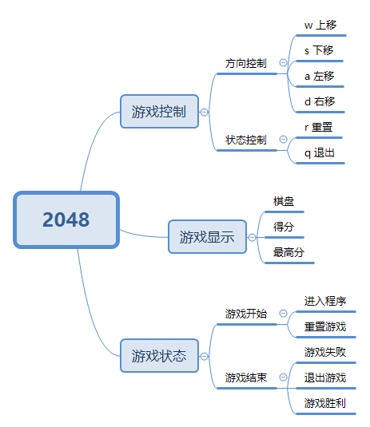
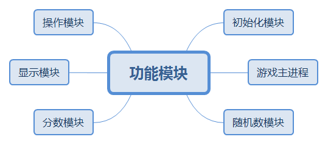

# python 实现 2048 游戏 （一）

初学 python ，大家恐怕都想找到一条终南捷径，会产生譬如 3 天精通 python 这样不太切合实际的想法。这种想法是很危险的，一旦你发现你根本不可能做到，你就会变得灰心丧气，甚至演变成 python 从入门到放弃的局面。实际上，**学习编程从来没有一步登天的捷径**。但对很多人来说，实践是十分有效的学习方法。这自然不是一条平坦的康庄大道，一路上你必须披荆斩棘，历尽坎坷与辛苦，然而你越努力、回报也就越丰厚。所以就让我们**一步一个脚印**，实现简单版的 2048 小游戏吧。

## **<span style="color: red">第一讲主要介绍编写 2048 游戏的前置知识</span>**

### 理清游戏逻辑

### 规则

2048 游戏是一款即时休闲游戏。

游戏规则：玩家通过 w s a d 控制数字移动方向，达成 2048 这个数字即获胜。

每次可以选择一个方向移动，数字便会朝这个方向移动，如果遇到相同数字就相加，遇到不同数字或者边界就停止移动。同时会在空白的地方生成 2 或者 4 的随机数字。通过不断相撞、相加，最后达成 2048 这个数字。

### 游戏结构图



### 运行环境

**win 10 :**

Pycharm + python 3.6 + curses + numpy(pip install numpy) + copy

**ubuntu 16.04 :**

Anaconda + python 3.6 + curses + numpy + copy

### windows 安装 curses

**curses**

网址：http://www.lfd.uci.edu/~gohlke/pythonlibs/#curses

下载  curses-2.2+utf8-cp36-cp36m-win_amd64.whl

```shell
pip install --upgrade curses-2.2+utf8-cp36-cp36m-win_amd64.whl
```

### curses 用法简介

curses 用于**终端 shell** 显示图形:

```python
# 屏幕不显示用户输入的字符
curses.noecho()
# 使用 curses 首先需要初始化
stdscr = curses.initscr()
# stdscr.getchar() 返回的是输入的单个字符的 ascii 码值
# 假如输入'p',返回 112
stdscr.getch()
# 清除屏幕
stdscr.clear()
# 打印字符
stdscr.addstr('You win')
```

### 功能模块




在这个简易版的 2048 游戏中，可以分为六大功能模块：

<span style="color: red">初始化模块</span>：初始化棋盘

<span style="color: red">主进程模块</span>：统筹各个函数模块

<span style="color: red">随机数模块</span>：在棋盘上随机产生 2 或 4

<span style="color: red">操作模块</span>：读取用户输入，并执行相应操作

<span style="color: red">显示模块</span>：显示棋盘

<span style="color: red">分数模块</span>： 当前得分与最高得分

**这一节主要介绍了 2048 小游戏的基本知识，下一节将介绍实现 2048 小游戏的各个模块的逻辑。最后放一张实现效果图**


**想了解更多请关注：**


